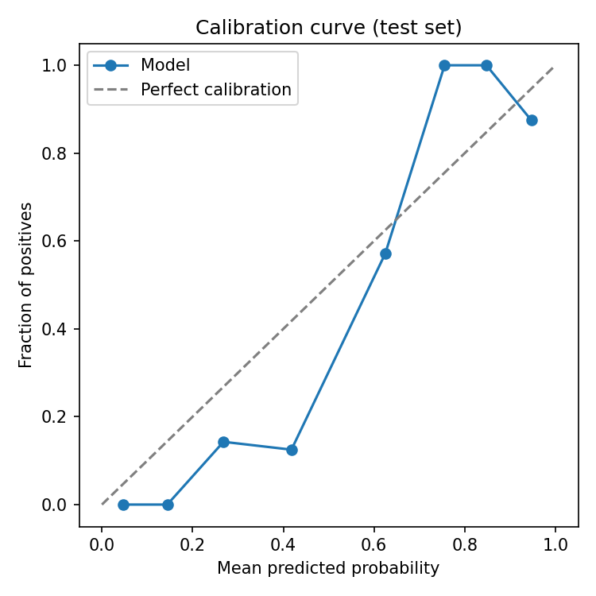

# Heart Disease Risk Prediction (Clinical ML)

[]()
[]()
[]()

> End-to-end classification pipeline predicting coronary heart disease from patient features (UCI Cleveland), with clinical-style evaluation metrics and reproducible `src/` modules.

**Author:** [Barrington Miller](https://github.com/Bgmiller50) — M.S. Data Science · B.S. Pharmacy · Healthcare & Life Sciences Analytics

⚠️ **Disclaimer:** This project is for **education and portfolio use only**. It is not validated for clinical decision-making.

---

## Problem & Context

Heart disease remains a leading cause of mortality. This project models binary disease presence from 13 clinical and demographic features, framed for **healthcare analytics** audiences — with sensitivity, specificity, and calibration analysis rather than accuracy alone.

| Feature | Clinical relevance |
|---------|-------------------|
| `chol` | Lipid management, statin counseling |
| `trestbps` | Hypertension / cardiovascular risk |
| `fbs` | Diabetes screening (fasting glucose proxy) |
| `thalach`, `exang`, `oldpeak` | Exercise stress / ischemia signals |
| `cp` | Angina presentation |

**Outcome:** Binary `target` — any angiographic disease (UCI labels 1–4) vs. none (0).

---

## Results

| Metric | Value |
|--------|-------|
| Best model | Random Forest |
| ROC-AUC | **0.958** |
| Sensitivity (at Youden threshold) | **89.3%** |
| Specificity | **97.0%** |
| PPV / NPV | 96.2% / 91.4% |
| Train / test split | 242 / 61 (stratified 80/20) |

<p align="center">
  
  
</p>

<p align="center">
  
</p>

### Key insights

1. **Exercise capacity (`thalach`) and ST depression (`oldpeak`)** are among the strongest discriminators — consistent with stress-test clinical signals.
2. **Class imbalance** handled via `class_weight="balanced"`; threshold tuned with Youden's J for screening-style sensitivity/specificity tradeoff.
3. **Calibration** is reasonable on held-out data, supporting probability-based risk stratification in exploratory settings.
4. **Small sample (n=303)** limits generalization — see limitations below.

---

## Approach

- **Data:** [UCI Heart Disease — Cleveland](https://archive.ics.uci.edu/ml/datasets/heart+disease) (303 patients, 14 features)
- **Preprocessing:** Median imputation + standard scaling in a `ColumnTransformer` (leakage-safe: fit on train only)
- **Models:** Logistic Regression vs. Random Forest (`n_estimators=300`), stratified train/test split
- **Selection:** Best model by held-out ROC-AUC
- **Evaluation:** ROC, confusion matrix, calibration curve, clinical metrics (sensitivity, specificity, PPV, NPV)

---

## Project structure

```
heart-disease-ml/
├── data/
│   ├── raw/                 # Downloaded UCI file (gitignored)
│   └── processed/           # Clean CSV
├── notebooks/
│   └── 01_eda_and_modeling.ipynb
├── src/
│   ├── config.py            # Paths, constants, column names
│   ├── load_data.py         # Download + clean
│   ├── train.py             # Train & select best model
│   └── evaluate.py          # Metrics + figures
├── models/                  # Saved model + JSON metadata (gitignored)
└── reports/figures/         # ROC, confusion matrix, calibration
```

---

## Quick start

```bash
git clone https://github.com/Bgmiller50/heart-disease-ml.git
cd heart-disease-ml
python -m venv .venv && source .venv/bin/activate
pip install -r requirements.txt
python -m src.load_data
python -m src.train --retrain
python -m src.evaluate
jupyter notebook notebooks/01_eda_and_modeling.ipynb
```

| Command | Purpose |
|---------|---------|
| `python -m src.load_data` | Download + process data |
| `python -m src.train` | Train models, save best |
| `python -m src.train --retrain` | Overwrite existing model |
| `python -m src.evaluate` | Metrics + figures |

---

## Limitations & bias

- **Single-center, dated cohort (1980s Cleveland)** — not representative of modern diverse populations.
- **n=303** — high variance in metrics; cross-validation recommended before any real-world use.
- **Missing values** imputed with medians; no external validation set.
- **Feature encoding** treats some ordinal variables as numeric — acceptable for baseline models, not for regulatory-grade systems.
- **No causal claims** — associations only; not for diagnosis or treatment decisions.

---

## Build from scratch (learning path)

The `src/` code is a completed reference. To rebuild yourself for interview prep:

1. Follow **[BUILD_FROM_SCRATCH.md](BUILD_FROM_SCRATCH.md)** — phase-by-phase (~7 days).
2. Work in a local `practice_build/` copy with empty stubs.
3. Compare with `src/` only when stuck.

---

## Tech stack

`Python` · `pandas` · `scikit-learn` · `matplotlib` · `seaborn` · `joblib` · `Jupyter`

---

## License

MIT — see [LICENSE](LICENSE) for details. UCI dataset used under its original terms.

---

## Contact

**Barrington Miller** — Austin, TX  
📧 barringtonmiller55@gmail.com · 🔗 [GitHub](https://github.com/Bgmiller50)
