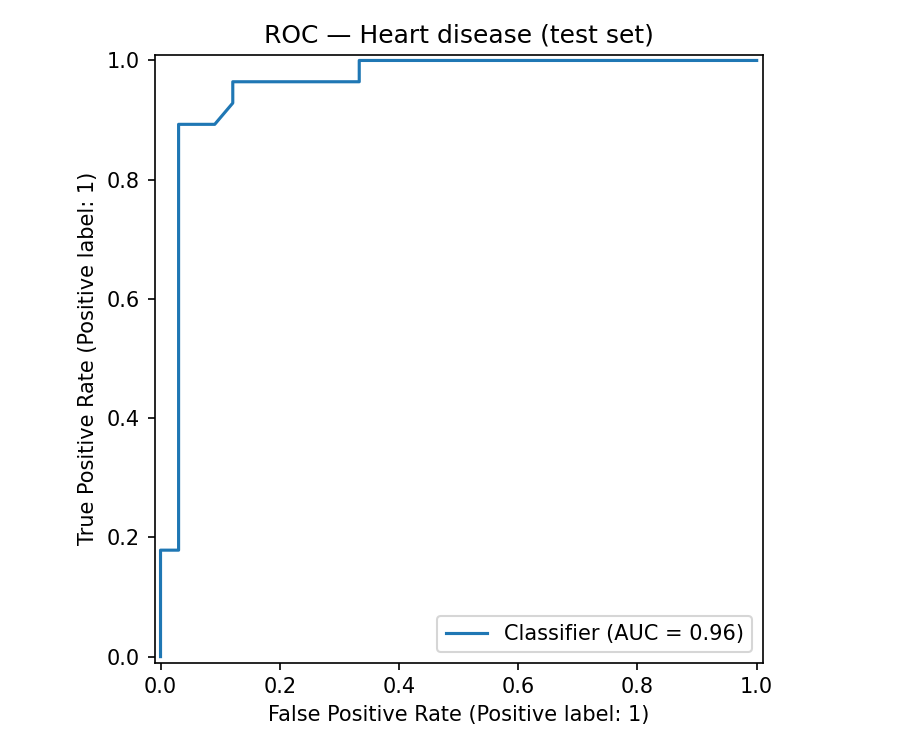
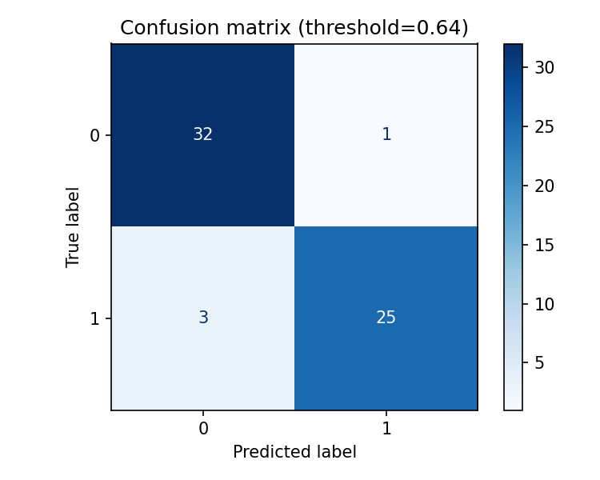
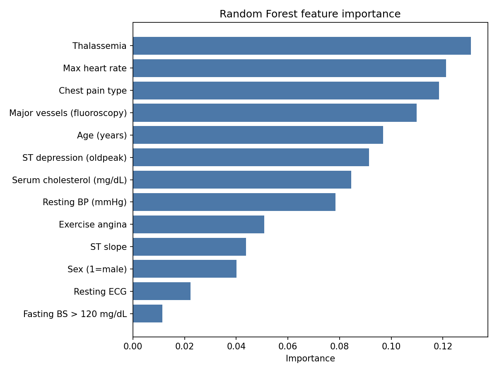
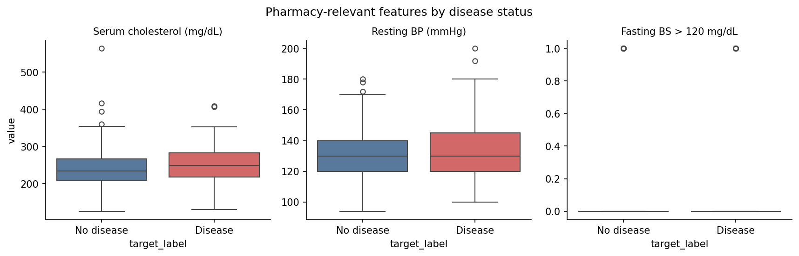
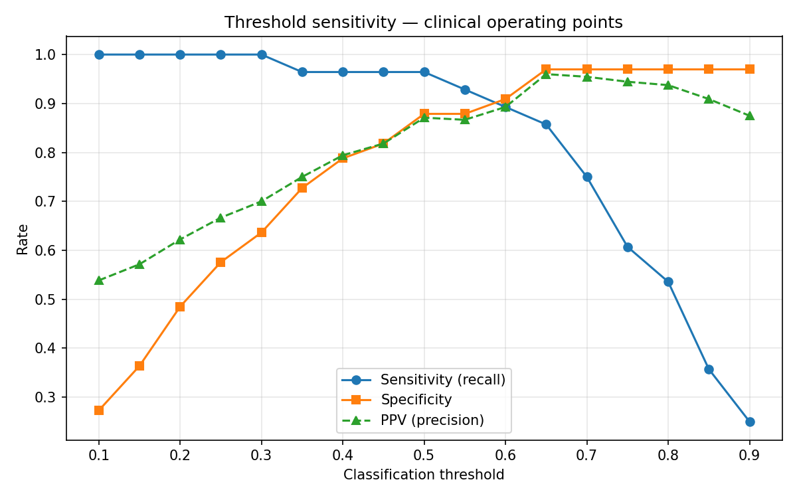

# Heart Disease Risk Prediction (Clinical ML)

[]()
[]()
[]()

> End-to-end clinical ML pipeline: data ingestion → EDA → model training → clinical evaluation → interpretation. One-command reproducibility via `make pipeline`.

**Author:** [Barrington Miller](https://github.com/Bgmiller50) — M.S. Data Science · B.S. Pharmacy

⚠️ **Disclaimer:** Not validated for clinical decision-making.

---

## What makes this end-to-end

| Stage | Module | Output |
|-------|--------|--------|
| 1. Data ingestion | `src/load_data.py` | Processed CSV from UCI source |
| 2. EDA | `src/eda.py` | Summary JSON + 5 exploratory figures |
| 3. Training | `src/train.py` | Model comparison with 5-fold CV |
| 4. Evaluation | `src/evaluate.py` | ROC, calibration, clinical metrics |
| 5. Interpretation | `src/interpret.py` | Feature importance + threshold sensitivity |
| 6. Orchestration | `src/run_pipeline.py` | Full pipeline in one command |
| 7. Narrative | `notebooks/01_end_to_end_analysis.ipynb` | Stakeholder walkthrough |
| 8. Report | `reports/PROJECT_REPORT.md` | Written analysis and recommendations |

---

## Results

| Metric | Value |
|--------|-------|
| Best model | Random Forest |
| Test ROC-AUC | **0.958** |
| 5-fold CV ROC-AUC | **~0.91** |
| Sensitivity (Youden threshold) | **89.3%** |
| Specificity | **97.0%** |

<p align="center">
  
  
  
</p>

<p align="center">
  
  
</p>

📄 **Full write-up:** [reports/PROJECT_REPORT.md](reports/PROJECT_REPORT.md) · 📓 **Notebook:** [notebooks/01_end_to_end_analysis.ipynb](notebooks/01_end_to_end_analysis.ipynb)

---

## Quick start

```bash
git clone https://github.com/Bgmiller50/heart-disease-ml.git
cd heart-disease-ml
python -m venv .venv && source .venv/bin/activate
pip install -r requirements.txt

# Run everything
make pipeline

# Or step by step
make data && make eda && make train && make evaluate && make interpret

# Tests
make test
```

---

## Project structure

```
heart-disease-ml/
├── docs/DATA_DICTIONARY.md       # Variable definitions
├── notebooks/
│   └── 01_end_to_end_analysis.ipynb
├── reports/
│   ├── PROJECT_REPORT.md         # Executive summary
│   ├── eda_summary.json
│   └── figures/
├── src/
│   ├── load_data.py              # Ingestion
│   ├── eda.py                    # Exploratory analysis
│   ├── train.py                  # Model training + CV
│   ├── evaluate.py               # Clinical metrics
│   ├── interpret.py              # Feature importance
│   └── run_pipeline.py           # Full orchestration
├── tests/test_pipeline.py        # Smoke tests
├── Makefile
└── requirements.txt
```

---

## Pipeline flow


---

## Clinical context

| Feature | Relevance |
|---------|-----------|
| `chol` | Lipid management, statin counseling |
| `trestbps` | Hypertension / CV risk |
| `fbs` | Diabetes screening proxy |
| `thalach`, `oldpeak` | Exercise stress / ischemia |
| `cp` | Angina presentation |

---

## Limitations

- Single-center 1980s cohort (n=303) — limited generalizability
- No external validation or fairness audit
- Missing values imputed with median
- Not for clinical deployment

---

## License & contact

MIT License · [LICENSE](LICENSE)

**Barrington Miller** — Austin, TX · barringtonmiller55@gmail.com · [GitHub](https://github.com/Bgmiller50)
